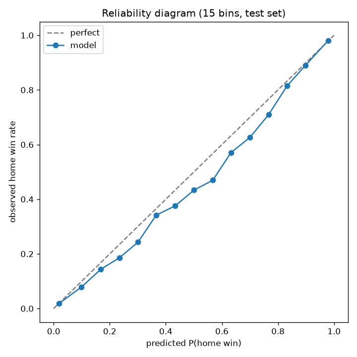
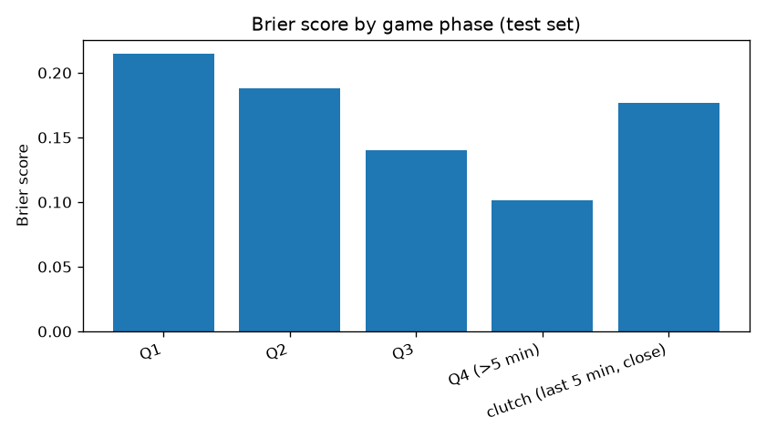
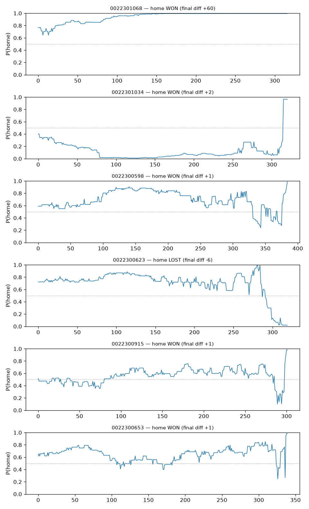

# Evaluation Report — NBA Live Win-Probability Model

Final model: monotone-constrained LightGBM (204 trees), calibration: **raw**. Test set = second half of the newest season by date, split by game. All probabilities are P(home win).

## Metrics (held-out test half-season)

| model | Brier ↓ | log loss ↓ | AUC ↑ |
|-------|---------|-----------|-------|
| naive (train home rate) | 0.25326 | 0.69971 | 0.50000 |
| logistic (4 features) | 0.16806 | 0.49213 | 0.83240 |
| gbt_raw | 0.15653 | 0.46632 | 0.85708 |
| gbt_isotonic | 0.15694 | 0.46763 | 0.85696 |
| gbt_platt | 0.15838 | 0.47861 | 0.85708 |

## Reliability

72% must mean 72% — the diagram below is the primary product check.

## Brier score by game phase

| phase | Brier |
|-------|-------|
| Q1 | 0.21486 |
| Q2 | 0.18829 |
| Q3 | 0.14016 |
| Q4 (>5 min) | 0.10164 |
| clutch (last 5 min, close) | 0.17652 |

Early-game Brier approaches the ~0.25 of a coin flip by construction (the game hasn't happened yet); what matters is the monotone decrease toward 0 as information arrives, and clutch not being catastrophically worse than Q4 overall.

## Trajectories (eyeball test)

Blowout, biggest comeback, OT, and close games from the test half — curves should be smooth-ish, end at ~0/1, and react to runs:

## Feature importance (gain, top 15)

| feature | gain share |
|---------|-----------|
| diff_per_sqrt_time | 50.0% |
| pregame_win_pct_diff | 13.1% |
| score_diff | 8.4% |
| pregame_win_pct_home | 7.8% |
| pregame_win_pct_away | 6.0% |
| largest_lead_away | 4.4% |
| largest_lead_home | 3.6% |
| rest_days_away | 2.1% |
| rest_days_home | 1.6% |
| lead_changes_so_far | 0.9% |
| seconds_remaining | 0.6% |
| time_since_lead_change | 0.5% |
| run_last_300s | 0.4% |
| home_timeouts_remaining | 0.3% |
| momentum_ewm | 0.1% |

## Known failure modes

- **Clutch end-games:** free-throw/foul-game sequences produce sharp probability swings; the model reacts a beat late on intentional-foul strategies (timeouts/fouls-to-give are only partially observed).
- **Early OT:** few OT training rows; probabilities cluster near 0.5 and are slower to separate than in regulation.
- **No lineup/injury signal:** a star ejection or injury changes true WP instantly; the model only learns it through subsequent scoring.
- **Turnover momentum unmodeled:** GameState carries no turnover signal (Phase 2 deviation), so dead-ball turnover runs are invisible until they become points.
